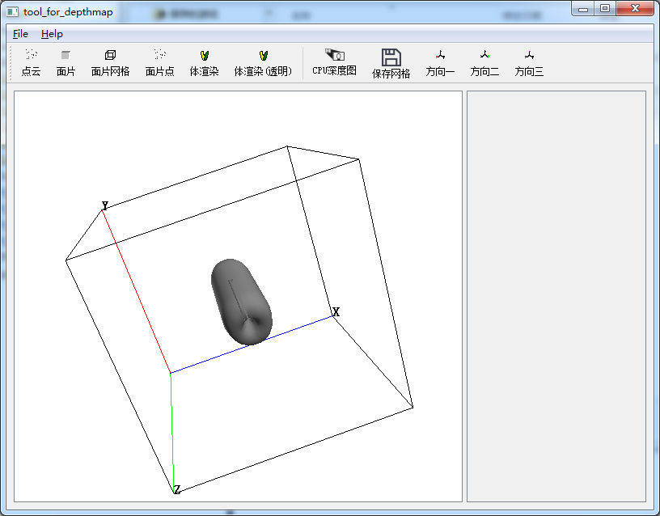

This is a tool for displaying voxel data( extract point cloud, simple volume rendering, pca), and you can get depth map from 3 main axis.

#require:
Qt5[change your vc++ directories in vs2010/12/13...] 

#usage:
drag **'test.dat'** file and drop to the program's ui.

program image:

